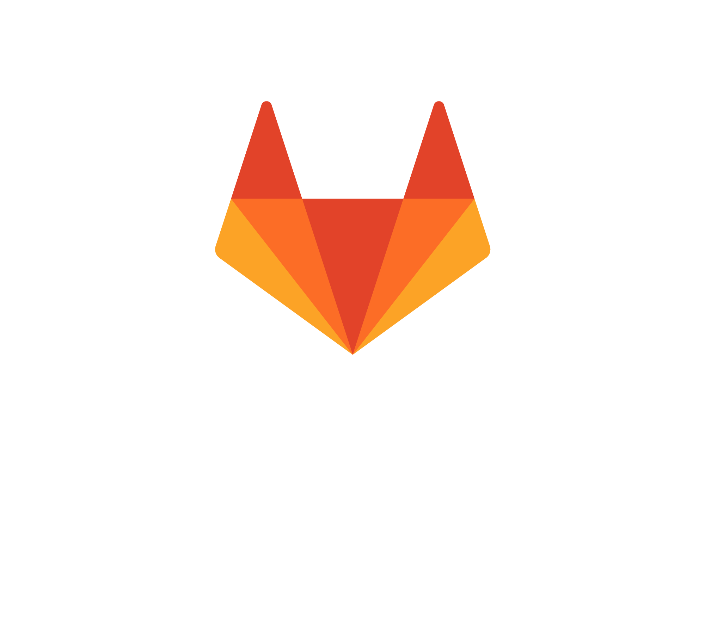

## Réalisations

### Ateliers BU (UPPA)
- [Prendre des notes et rédiger en *markdown*](https://atelier-markdown-uppa.netlify.app/#/), mars 2021

### Divers (sur netlify)
- [Wiki *Zotero avancé*](https://uju-zotero-tw.netlify.app) (Tiddliwiki)
- [Documentation du *projet Blot*](https://inventaire-blot.netlify.app) et inventaire en ligne, février 2021
- [HALathon HAL e2s UPPA](https://halathon2021-hal-e2s-uppa.netlify.app), 2020-2021 (dernière mise à jour, 29 mars 2021)

## Présence en ligne

### Tumblr
- [La fausse sceptique](https://sceptique.tumblr.com)
  - [Son tumbview (en mode diaporama aléatoire)](http://tumbview.com/sceptique/slideshow/random/)

|Logo|Site|PP|profil|uri|
|---|---|---|---|---|
||Orcid||[Julien Rabaud](https://orcid.org/0000-0002-6604-9777)|`https://orcid.org/0000-0002-6604-9777`|
||LinkedIn| |[Julien Rabaud](https://www.linkedin.com/in/julien-rabaud-6b037110/)|`https://www.linkedin.com/in/julien-rabaud-6b037110/`|
||Twitter| |[@UjuBib](https://twitter.com/UjuBib)|`https://twitter.com/UjuBib`|
||Mastodon| |[@UjuBib@mamot.fr](https://mamot.fr/@UjuBib)|`https://mamot.fr/@UjuBib`|
||Diaspora| |[uju@framasphere.org](https://framasphere.org/people/454a54302aaa013283742a0000053625)|`https://framasphere.org/people/454a54302aaa013283742a0000053625`|
||Instagram| |[ujubib](https://www.instagram.com/ujubib/)|`https://www.instagram.com/ujubib/`|
||SeenThis||[lldur](https://seenthis.net/people/lldur)|`https://seenthis.net/people/lldur`|
||GitLab UPPA||[@jrabaud001](https://git.univ-pau.fr/jrabaud001)|`https://git.univ-pau.fr/jrabaud001`|
||GitHub||[@ujubib](https://github.com/ujubib)|`https://github.com/ujubib`|
||Slides||[Uju Bib](https://slides.com/ujubib)|`https://slides.com/ujubib`|
||Zotero||[Julien Rabaud](https://www.zotero.org/ujubib)|`https://www.zotero.org/ujubib`|
||HAL||[julien-rabaud](https://cv.archives-ouvertes.fr/julien-rabaud)|`https://cv.archives-ouvertes.fr/julien-rabaud`|
||Academia|||``|
||ResearchGate|||``|
||Diigo|||``|
||Pocket|||``|
||Inventaire.io|||``|
||OpenProcessing|||``|
||OSF|||``|
||Netvibes|||``|
||Publons|||``|
||SlideShare|||``|

